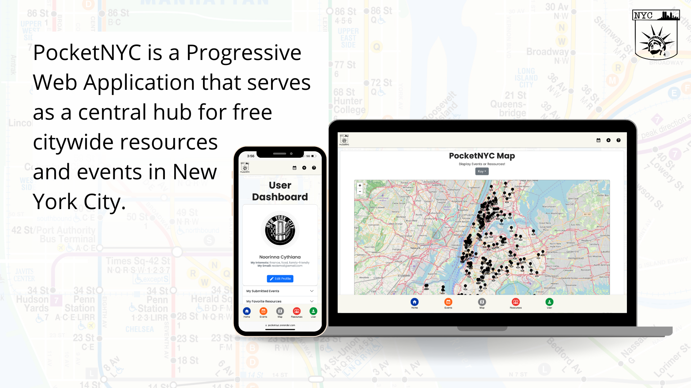
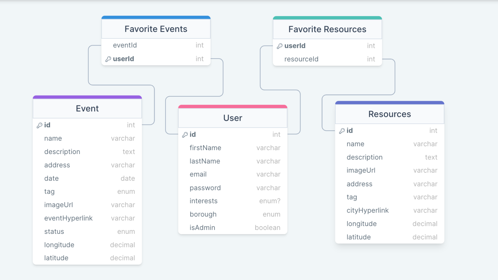
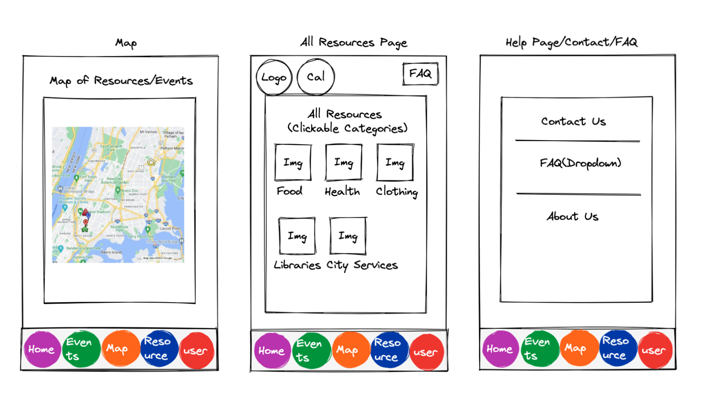
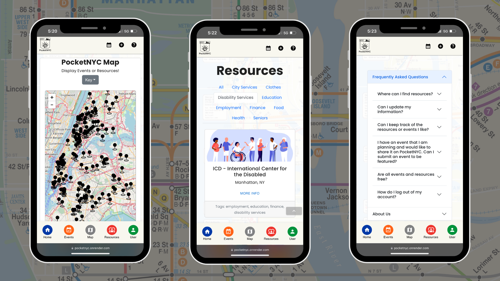

<h1 align="center"> PocketNYC </h1>

    
    <a href='https://pocketnyc.onrender.com/'>View the live website here!</a> 

 

In creating our application, we utilized Postgres, Express, React, and Node (PERN) alongside external libraries, MaterialUI, Bootstrap, Leaflet, and React Big Calendar, which allowed us to develop features to enhance a visitor's experience. Additionally, we applied JSON Web Tokens and Bcrypt for visitors to be able to create an account to become authenticated users with login capability for future visits. By resourcing the NYC Open Data API, PocketNYC gives you access to many cultural, family-friendly, and community-based events throughout the 5 boroughs and opens up over 190 resources for use including legal representation, job opportunities, and health facilities to name a few. Users are able to favorite resources and events, add events to their calendar, suggest upcoming events, and even view events on an open-source map. Developed for New Yorkers by New Yorkers, PocketNYC is your go-to for all things free in NYC.

<!-- 
     -->
<b>From ideation to execution, a lot of thought and creativity went into developing and designing PocketNYC.
 
 
Take a look at some sneak-peeks of our full-stack application:</b>

<h2 style="text-align:center">What's going on "behind the scenes"?</h2>
<!-- 
 -->

 
This schema was used to create associations in a SQL relational database. We leveraged PostgreSQL, Sequelize, NodeJS, and other back-end technologies to maintain data and enhance our user's experience. 
 

<h2 style="text-align:center">The Blueprint vs. the Final Build</h2>

Our basic wireframe helped lay the groundwork for our overall design. We utilized MatieralUI, Bootstrap, and CSS to develop an app that has subtle hints of NYC on every page. 

Creators: [Breana Johnson](https://www.linkedin.com/in/breanaj/), [Corinna De Jesus](https://www.linkedin.com/in/corinnadejesus/), [Cynthia Brito Mena](https://www.linkedin.com/in/cynthiabritomena/), and [Noor Mudassar](https://www.linkedin.com/in/noormudassar/)
