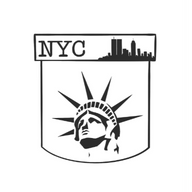

# PocketNYC

[Website](https://pocketnyc.onrender.com/)

## Premise

PocketNYC is a Progressive Web Application that serves as a central hub for free city-wide resources and events in New York. In creating our application, we utilized Postgres, Express, React, and Node (PERN) stack alongside external libraries, MaterialUI, Bootstrap, Leaflet, and React Big Calendar, which allowed us to develop features to enhance a visitor's experience. Additionally, we applied JSON Web Tokens and Bcrypt for visitors to be able to create an account to become authenticated users with login capability for future visits. By resourcing the NYC Open Data API, PocketNYC gives you access to many cultural, family-friendly, and community-based events throughout the 5 boroughs and opens up over 190 resources for use including legal representation, job opportunities, and health facilities to name a few. Users are able to favorite resources and events, add events to their calendar, suggest upcoming events, and even view events on an open-source map. Developed for New Yorkers by New Yorkers, PocketNYC is your go-to for all things free in NYC.

____________________________

Creators: [Breana Johnson](https://www.linkedin.com/in/breanaj/), [Corinna De Jesus](https://www.linkedin.com/in/corinnadejesus/), [Cynthia Brito Mena](https://www.linkedin.com/in/cynthiabritomena/), and [Noor Mudassar](https://www.linkedin.com/in/noormudassar/)
